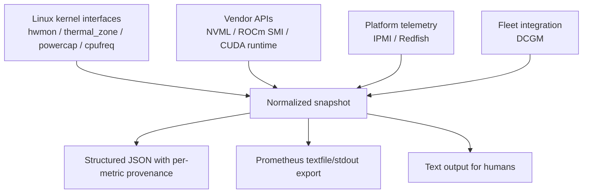
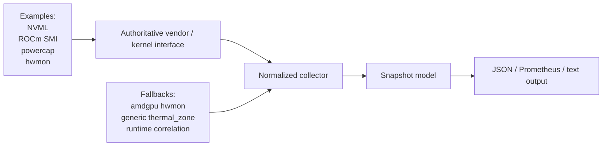

# Why Thermal Observatory Exists

`thermal-observatory` started from a very practical systems problem:

we have more thermal data than ever, but less coherence than we need.

Modern servers expose temperature, power, throttling, and environmental state across many different layers:

- CPU-local sensors
- GPU vendor APIs
- Linux sysfs and kernel interfaces
- power capping frameworks
- BMC and chassis telemetry
- fleet-facing vendor stacks such as DCGM

Every one of those layers is useful. None of them, by itself, is enough.

That is the gap this repository is trying to close.

Repository: [github.com/manishklach/thermal-observatory](https://github.com/manishklach/thermal-observatory)

## The Problem

Thermal observability is usually fragmented in practice.

If you are debugging a real machine today, you often end up doing some version of this:

- `nvidia-smi` for GPU temperature and clocks
- `rocm-smi` for AMD GPUs
- `sensors` for `hwmon`
- `cat /sys/class/thermal/...` for thermal zones
- `cat /sys/class/powercap/...` for RAPL
- `ipmitool sdr` for chassis and fan telemetry
- `dcgmi` if you are on a managed NVIDIA fleet

This creates a few persistent problems:

1. There is no single normalized output.
2. Provenance is unclear once people copy values into dashboards or scripts.
3. Runtime identity and telemetry identity are often disconnected.
4. Silicon telemetry and environmental telemetry are split.
5. Cross-vendor comparison is painful.
6. Automation ends up built on brittle shell parsing.

In other words, we have tools, but not yet a framework.

## What Is Being Done Today

Today, thermal monitoring is usually done in one of four ways.

### 1. Vendor CLI First

This is the most common path.

- NVIDIA users rely on `nvidia-smi`
- AMD users rely on `rocm-smi`
- cluster operators may rely on `dcgmi`

This works well for a narrow slice of the problem. It does not solve system-wide correlation.

### 2. Linux Interface First

This path uses:

- `hwmon`
- `thermal_zone`
- `powercap`
- `cpufreq`

This is attractive because it is portable within Linux, but it is often shallow or inconsistent across platforms.

### 3. BMC / Platform First

Datacenter teams often start with:

- `ipmitool`
- Redfish
- vendor BMC dashboards

This helps answer facility and chassis questions, but it usually does not tell the full story inside the CPU or GPU.

### 4. Ad Hoc Script Glue

This is what many teams end up maintaining:

- shell scripts
- Python glue
- Grafana exporters
- host-specific dashboards

It solves the immediate problem, but usually does not survive hardware churn cleanly.

## What Thermal Observatory Is

`thermal-observatory` is a hardware-aware thermal observability framework for:

- CPU telemetry
- GPU telemetry
- board and chassis telemetry
- platform and fleet-facing integration points

It is not trying to replace every vendor tool. It is trying to become the normalization and correlation layer above them.

The key design idea is simple:

> use the most authoritative interface available, preserve provenance, and expose one coherent snapshot model.

## The Core Idea

Instead of forcing every downstream consumer to know every vendor API and Linux path, the repo builds around one normalized snapshot contract.

At the center of the repo is [include/thermal_monitor.h](/C:/Users/ManishKL/Documents/Playground/thermal-observatory/include/thermal_monitor.h).

That header defines the public model for:

- CPU packages and cores
- ARM thermal clusters
- NVIDIA GPUs
- AMD GPUs
- generic `hwmon` sensors
- generic thermal zones
- board sensors
- fan sensors
- PSU sensors

The JSON layer then emits those measurements with per-metric provenance:

- `value`
- `unit`
- `source`
- `timestamp_ns`
- `error`

That matters because “72 C” is not enough. We also need to know:

- where that number came from
- when it was sampled
- whether it was authoritative or a fallback
- whether the value is stale or partial

## Why This Is Needed

There are three reasons this matters now more than before.

### 1. Heterogeneous Compute Is Normal

A modern node may contain:

- x86 or ARM CPUs
- NVIDIA or AMD GPUs
- Linux kernel thermal interfaces
- BMC-managed platform sensors

Thermal tooling that only understands one layer is now incomplete by default.

### 2. Throttling Is Usually Multi-Layer

A GPU slowdown is not always “the GPU got hot.”

It might be:

- local accelerator heat
- a board cooling issue
- high chassis inlet temperature
- fan saturation
- PSU thermal behavior
- rack or room thermal stress

If you only inspect silicon telemetry, you miss the wider context.

### 3. Observability Systems Need Stable Machine Output

Humans can tolerate ad hoc CLI output.

Monitoring systems cannot.

For automation, alerting, and dashboarding, we need:

- stable JSON
- explicit units
- explicit provenance
- reliable export paths such as Prometheus textfile output

## What This Repo Addresses

The repository addresses several concrete problems.

### Unified Output

It gives one structured snapshot instead of many incompatible tools.

### Provenance

It preserves where each metric came from.

### Runtime Correlation

For NVIDIA, the repo separates:

- NVML as the primary telemetry interface
- CUDA runtime as the runtime/device correlation layer

That is an important distinction. CUDA is not the thermal API. NVML is.

### Datacenter Direction

The repo has begun the “silicon plus environment” path through:

- IPMI scaffold
- Redfish scaffold
- DCGM scaffold

That is strategically important because it lets the project evolve beyond chip-local monitoring.

### Testability

Through `TM_SYSROOT`, Linux sensor-path collectors can run against mocked fixture trees. That means the repo can test Linux thermal logic without always needing live hardware.

## High-Level Architecture



The repository does not assume that one source is always enough. Instead it layers sources into a shared snapshot.

## Source Hierarchy

The repo follows a practical source hierarchy.



The goal is not to pretend that all sources are equivalent. The goal is to make differences visible rather than hiding them.

## Why The Repo Structure Matters

One reason this project is important is not just what it collects, but how it is organized.

The structure is intentional:

```text
include/                 Public snapshot model and API
src/cpu/                 x86 and arm64 CPU collectors
src/gpu/                 NVIDIA and AMD collectors
src/platform/            Linux paths, IPMI, Redfish scaffolds
src/format/              JSON, Prometheus, and text output
tests/                   Fixture-backed validation
samples/                 Example outputs
docs/                    Design, architecture, release, and blog docs
```

That structure helps the repo do something many thermal projects do not:

- separate collection from formatting
- separate stable userspace logic from experimental low-level work
- make the snapshot model the center of the design
- keep room for future vendor/platform growth

## Why The Repo Is Important

This repo matters because it aims to occupy a missing layer in the systems stack.

### Vendor Tools Are Necessary But Narrow

Vendor tools are strong at device-level introspection, but they are not trying to be a multi-vendor, multi-layer normalization framework.

### Generic Linux Interfaces Are Broad But Uneven

Linux gives a lot of data, but not always in a way that is easy to consume across hardware generations.

### Datacenter Operators Need Correlation

Operators increasingly need to answer questions like:

- Is this GPU throttling because its hotspot is high?
- Or because chassis inlet air is already too warm?
- Or because the board and PSU are under thermal stress?

That is not a one-tool question.

### Researchers And Performance Engineers Need Programmable Output

For experiments, profiling, performance debugging, and fleet health analysis, stable machine-readable output matters as much as the raw measurements.

## Current Capabilities

As of `v0.1.0`, the project supports:

- versioned JSON schema
- per-metric provenance in JSON
- Prometheus export
- Linux fixture-backed collector testing
- NVIDIA telemetry via NVML
- NVIDIA runtime correlation via CUDA
- AMD telemetry via ROCm SMI and `amdgpu` fallback
- Linux thermal interfaces such as `hwmon`, `thermal_zone`, `powercap`, and `cpufreq`
- early datacenter telemetry scaffolds for IPMI, Redfish, and DCGM

The current release notes are in [docs/releases-v0.1.0.md](/C:/Users/ManishKL/Documents/Playground/thermal-observatory/docs/releases-v0.1.0.md).

## What It Does Not Claim Yet

It is important to be honest here.

The repo is not yet claiming:

- complete production hardening
- full real-hardware validation across many machine classes
- full Redfish JSON support
- deep DCGM field ingestion
- AMD runtime correlation parity with CUDA

That honesty is a strength. The repo is trying to be explicit about what is implemented, what is scaffolded, and what still needs fleet validation.

## Why The Testability Story Matters

One of the strongest parts of the current design is `TM_SYSROOT`.

With `TM_SYSROOT`, Linux collectors that normally read `/sys/...` can instead read a mocked fixture tree. That matters because it makes the project testable without requiring live access to:

- a specific server
- a specific GPU
- a specific kernel sensor layout

This is one of the best signs that the project is becoming a real framework rather than a one-machine script bundle.

## Where This Could Go

There are several high-value next steps.

### Real Platform Hardening

- real Redfish JSON parsing
- stronger IPMI normalization
- deeper DCGM field support

### Fleet Integration

- more Prometheus integration patterns
- real-world sample captures from production-class hardware
- correlation hints and diagnostics in the JSON output

### Cross-Vendor Runtime Correlation

- ROCm runtime correlation to match the CUDA path

### Better Operational Semantics

- stale-data handling
- explicit partial-failure reporting
- freshness checks
- correlation hints such as “high inlet + high hotspot”

## The Larger Point

Thermal telemetry is no longer just a “sensor reading” problem.

It is an observability problem.

That means we need:

- normalized structure
- explicit provenance
- layered data sources
- integration into monitoring systems
- room for platform-level reasoning

That is what `thermal-observatory` is trying to become.

## Read The Repo

If you want to explore the project directly:

- Repo: [github.com/manishklach/thermal-observatory](https://github.com/manishklach/thermal-observatory)
- README: [README.md](/C:/Users/ManishKL/Documents/Playground/thermal-observatory/README.md)
- Public model: [include/thermal_monitor.h](/C:/Users/ManishKL/Documents/Playground/thermal-observatory/include/thermal_monitor.h)
- Design notes: [docs/design.md](/C:/Users/ManishKL/Documents/Playground/thermal-observatory/docs/design.md)
- Architecture notes: [docs/architecture.md](/C:/Users/ManishKL/Documents/Playground/thermal-observatory/docs/architecture.md)
- Datacenter direction: [docs/datacenter-telemetry.md](/C:/Users/ManishKL/Documents/Playground/thermal-observatory/docs/datacenter-telemetry.md)
- Release notes: [docs/releases-v0.1.0.md](/C:/Users/ManishKL/Documents/Playground/thermal-observatory/docs/releases-v0.1.0.md)

The project is still early, but it already shows why this layer is needed:

not because we lack thermal interfaces, but because we lack a clean way to unify them.

